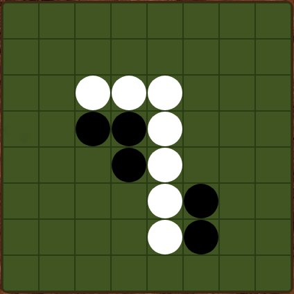

# wdi-project-1
My first project for WDI London at GA

# Othello / Reversi
I got my info about the game of Othello here: 

[Othello Strategy guide](http://radagast.se/othello/Help/strategy.html), also [Wikipedia] (https://en.wikipedia.org/wiki/Reversi)

Check it out here:
[Heroku](https://infinite-meadow-13142.herokuapp.com/)

Othello is a highly strategic game where you take enemy pieces by flanking them with your own. Originally given the name Reversi when it was invented, it was rebranded as Othello by Mattel.

I chose it because it is very logic heavy, 

# Project Brief

* Create a game utilising our 2 weeks of knowledge on HTML, CSS and JavaScript.
* Create a two player game or a computer opponent to beat.
* Built the game using object orientated programming if possible.

This game was built with HTML/CSS and JavaScript with jQuery. 

It's entirely created by the JavaScript and delivered to the DOM, the html is just the boilerplate.

# It plays back

I modified the function that checks wether a move is valid, then repeated it for every square on the board to find the moves that will score highest. 
At the moment, it doesn't think at all, it just finds the best move and takes it, an aggressive strategy. It only looks at the board at that time.

An experienced player could beat or trap it. 

In the long run I plan to modify it further to predict a few moves ahead and attempt to minimize the player's moves, rather than just scoring as high as possible every turn. 